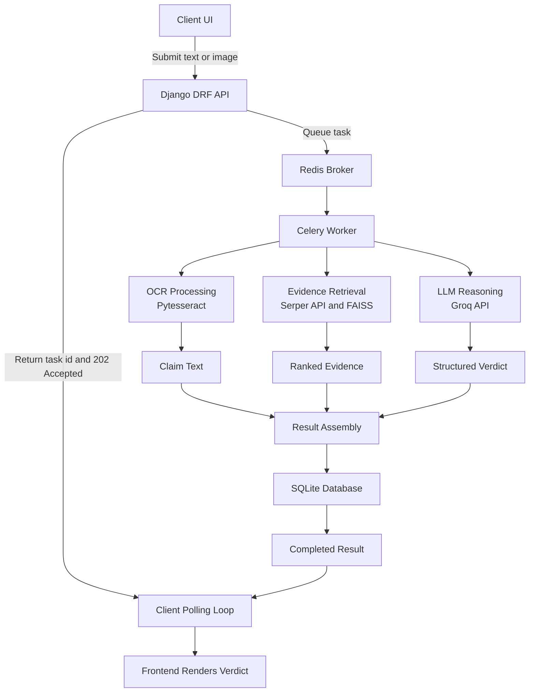

# Misinfo Guard
<p align="center">
  
</p>


Automated fact-checking platform for verifying text and image-based claims using OCR, live web retrieval, and LAG-based reasoning.

Misinfo Guard is a full-stack misinformation detection system designed to help users submit a claim, process it asynchronously, gather supporting evidence, and return a structured verification result. The project is built to be understandable for beginners while still reflecting production-style engineering practices such as background task processing, API-based architecture, and modular components.

## What it does

Misinfo Guard helps users verify suspicious content from plain text or screenshots.

- Accepts claim text or uploaded images.
- Extracts readable text from screenshots using OCR.
- Searches for supporting and opposing evidence from external sources.
- Scores and filters sources to improve result quality.
- Uses an LLM to generate a structured fact-check response.
- Returns a final result in a predictable JSON format for the frontend.

## Why this project matters

False information spreads quickly, especially through short posts, forwarded screenshots, and edited images. Misinfo Guard is designed to reduce manual verification effort by combining search, OCR, source filtering, and AI-based reasoning in one pipeline.

For beginners, this project is also a strong example of how modern backend systems are built: the web server handles user requests, background workers handle heavy tasks, and the frontend polls for results without blocking the app.

## Features

### User-facing
- Submit a text claim for verification.
- Upload screenshots containing possible claims.
- Track verification status while processing runs in the background.
- View structured results with verdict, explanation, and sources.

### Engineering-focused
- Asynchronous task execution with Celery.
- Redis as the message broker.
- OCR pipeline for image-based claims.
- Retrieval pipeline using search and vector indexing.
- Source credibility scoring based on domain trust.
- Structured JSON output for reliable UI integration.
- Modular architecture that separates frontend, API, worker, and storage layers.

## Tech stack

| Layer | Technology | Purpose |
|---|---|---|
| Frontend | HTML5, JavaScript, Tailwind CSS | User interface and result rendering |
| Backend | Django, Django REST Framework | API endpoints and request handling |
| Database | SQLite | Stores task state and verification results |
| Task Queue | Celery | Runs heavy jobs in the background |
| Broker | Redis | Passes tasks from Django to Celery workers |
| OCR | Pytesseract, Pillow | Extracts text from uploaded screenshots |
| LLM | Groq API (`llama-3.3-70b-versatile`) | Reasoning and structured fact-check generation |
| Retrieval | Serper API, FAISS | Search-based evidence gathering and indexing |

## How the system works

### Simple flow
1. A user submits text or an image from the frontend.
2. Django receives the request and immediately returns a task ID.
3. The request is placed in Redis.
4. A Celery worker picks up the task.
5. If the input is an image, OCR extracts the claim text.
6. The system retrieves supporting context from search and indexed data.
7. A reasoning model evaluates the evidence and creates a final verdict.
8. The result is stored in SQLite.
9. The frontend polls the backend and displays the completed result.

### Architecture overview

```text
[ Client UI ] ---> [ Django API ] ---> [ Redis Broker ] ---> [ Celery Worker ]
       |                                                          |
       |                                                          +--> OCR Processing
       |                                                          +--> Evidence Retrieval
       |                                                          +--> LLM Reasoning
       |
       +<---------------------- Result Polling -------------------+
                                  |
                                  v
                             [ SQLite DB ]
```

## Project structure

The repository follows a modular Django layout so each part of the system has a clear responsibility. This makes the code easier to understand, debug, and extend as the project grows.

```text
Misinfo-Guard/
├── .env.example          # Sample environment variables
├── .gitignore            # Ignores virtual env, database, and secrets
├── requirements.txt      # Python dependencies
├── manage.py             # Django project entry point
├── README.md             # Project documentation
│
├── core/                 # Global Django configuration
│   ├── __init__.py
│   ├── settings.py       # Installed apps, middleware, database, API keys
│   ├── urls.py           # Main URL routing
│   ├── asgi.py           # ASGI entry point
│   ├── wsgi.py           # WSGI entry point
│   └── celery.py         # Celery app configuration
│
├── claims/               # Main fact-checking application
│   ├── __init__.py
│   ├── admin.py          # Django admin registration
│   ├── apps.py           # App configuration
│   ├── models.py         # Database models for claims and results
│   ├── views.py          # API endpoints and request handling
│   ├── serializers.py    # Request and response validation
│   ├── urls.py           # App-level routes
│   ├── tasks.py          # Background verification jobs
│   └── ai_engine.py      # OCR cleanup, retrieval, scoring, LLM logic
│
├── templates/            # HTML templates
│   └── index.html        # Main frontend page
│
├── static/               # Static assets
│   ├── css/
│   ├── js/
│   └── images/
│
└── db.sqlite3            # Local development database
```

This structure follows the general Django idea of separating project-level configuration from app-level business logic, which improves maintainability in larger projects.

## System flow

The application uses asynchronous processing so the frontend does not freeze while verification is running.



### Step-by-step explanation
1. The user submits a claim as text or image.
2. Django receives the request and creates a task.
3. Redis stores the queued task.
4. Celery processes the task in the background.
5. OCR extracts text if the input is an image.
6. Retrieval gathers evidence from search and indexed data.
7. The LLM evaluates the evidence and produces a structured result.
8. The result is saved in SQLite.
9. The frontend polls the backend and displays the final verification output.

GitHub supports fenced code blocks and Mermaid diagrams in Markdown, which makes repository documentation easier to read and maintain for engineering projects [1][2][3]. Repository READMEs are also more useful when they clearly map folders to application responsibilities and help new contributors understand where key logic lives [4].

## Setup requirements

Before running the project, make sure the following are installed:

- Python 3.10 or higher
- Redis server
- Tesseract OCR engine
- Git
- A virtual environment tool such as `venv`

## Installation

### 1. Clone the repository

```bash
git clone https://github.com/Thejasvikrishna/Misinfo-Guard.git
cd misinfo-guard
```

### 2. Create and activate a virtual environment

```bash
python -m venv venv
```

On Linux or macOS:

```bash
source venv/bin/activate
```

On Windows:

```bash
venv\Scripts\activate
```

### 3. Install dependencies

```bash
pip install -r requirements.txt
```

## Environment variables

Add your secrets to `.env` file in the project root :

```env
DEBUG=True
SECRET_KEY=your_django_secret_key
GROQ_API_KEY=your_groq_api_key
SERPER_API_KEY=your_serper_api_key
```

You can also add values such as database paths, allowed hosts, or OCR configuration later as the project grows.

## Database setup

Run Django migrations to create the local database schema:

```bash
python manage.py makemigrations
python manage.py migrate
```

## Running the project

This project uses three main processes during development.

### Terminal 1: Start Redis

```bash
redis-server
```

### Terminal 2: Start Celery worker

```bash
celery -A your_project_name worker --loglevel=info
```

Replace `your_project_name` with the actual Django project module name.

### Terminal 3: Start Django server

```bash
python manage.py runserver
```

Then open:

```text
http://127.0.0.1:8000/
```

## Example usage

### Verify a text claim
- Open the frontend.
- Paste a claim such as: `A city has banned all electric vehicles in 2026.`
- Submit the claim.
- Wait for processing to complete.
- Review the verdict, explanation, and source links.

### Verify an image-based claim
- Upload a screenshot from social media or messaging apps.
- OCR extracts the visible text.
- The cleaned claim is passed to the retrieval and reasoning pipeline.
- The final response is shown once the worker completes the task.

## Security and reliability

This project includes several design choices that improve stability and maintainability.

- Structured JSON output reduces parsing errors between backend and frontend.
- Background task execution prevents long-running verification jobs from freezing the web request cycle.
- Source filtering improves the quality of retrieved evidence.
- Polling-based status checks make the UI responsive during heavy processing.
- Modular services make the system easier to test, debug, and extend.

## Beginner notes

If you are new to Django or Celery, here is the easiest way to understand the system:

- Django is the web server that receives requests.
- Redis is the middle layer that stores queued jobs.
- Celery is the worker that performs time-consuming tasks.
- SQLite stores results so the frontend can fetch them later.
- OCR reads text from images.
- The LLM helps analyze evidence and create a verdict.

Think of it like a restaurant workflow: the frontend takes the order, Redis passes it to the kitchen, Celery cooks it, and the database stores the final dish until the customer picks it up.

## Future improvements

- Add user authentication and saved verification history.
- Support multilingual OCR and fact-checking.
- Store results in PostgreSQL for larger deployments.
- Add Docker and Docker Compose for easier setup.
- Add unit tests and CI/CD pipelines.
- Introduce confidence scoring dashboards and analytics.

## Contributing

Contributions are welcome.

1. Fork the repository.
2. Create a new feature branch.
3. Commit your changes.
4. Open a pull request with a clear description.

## License

Add your preferred license here, such as MIT, Apache-2.0, or GPL.
